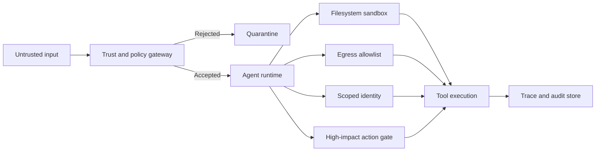

# Agent Capability Containment

## Recommendation

**[Official recommendation + engineering synthesis]**

Protect agentic systems by limiting what the agent can technically access and change. Human approval remains useful for high-impact decisions, but repeated permission prompts must not be the primary security boundary.

Containment should survive a mistaken approval, prompt injection, malicious repository or document content, model misinterpretation, tool-selection errors, and compromised downstream data.

## Threat model

An agent may receive instructions or configuration from untrusted sources while holding access to filesystems, shells, internal APIs, cloud identities, source repositories, network destinations, and production operations. Risk depends not only on the probability of a bad action but also on the maximum damage the agent can cause.

## Control hierarchy

### 1. Establish trust before loading local behaviour

Treat repository files, workspace configuration, hooks, plugins, localhost listeners, and generated instructions as untrusted until trust is explicitly established. Do not execute project-local hooks or behaviour-changing configuration before that decision.

### 2. Apply least-privilege identity

- Use workload identity or short-lived credentials where available.
- Separate read, write, approval, and administrative identities.
- Scope credentials to the minimum resources and operations.
- Do not expose broad tokens in model-visible context.

### 3. Isolate filesystem and process access

- Make the default workspace read-only where practical.
- Permit writes only to explicit directories.
- Run generated code and shell commands in a sandbox or disposable environment.
- Block access to host secrets, credential stores, sockets, and unrelated mounts.
- Treat archive extraction, symlinks, and path traversal as security-sensitive operations.

### 4. Control network egress

- Deny network access by default for tools that do not require it.
- Allowlist destinations, ports, methods, and protocols.
- Route sensitive outbound requests through an auditable proxy or gateway.
- Prevent access to metadata services and internal control planes unless explicitly required.

### 5. Gate irreversible actions separately

Require a distinct policy decision for external communications, production deployment, deletion or overwrite of durable data, permission changes, financial approvals, and administrative operations. Approval should display the proposed action, target, relevant diff or payload, and expected consequence rather than only a generic tool name.

### 6. Observe allowed and blocked behaviour

Record requested tools and arguments, identity and policy decisions, permitted and blocked resources, execution results, human overrides, and trace identifiers. Do not place secrets or unnecessary personal data in logs.

## Reference architecture

## When to use

Apply this pattern whenever an agent can execute code, modify state, use credentials, call external services, or process instructions from sources outside the trusted control plane.

## When this is insufficient

Containment does not replace secure tool implementation, input/output validation, prompt-injection defences, evaluation, business authorisation, data governance, or incident response.

## Common anti-patterns

- Approval prompts as the only defence
- Full host access for convenience
- Loading untrusted hooks or configuration before trust establishment
- Broad shared credentials across development, test, and production

## Validation checklist

- [ ] Untrusted configuration cannot execute before trust is established.
- [ ] The agent has no implicit access to developer or host credentials.
- [ ] Filesystem write paths are explicit and testable.
- [ ] Network egress is denied or allowlisted.
- [ ] High-impact actions have a separate policy gate.
- [ ] Blocked actions are included in telemetry.
- [ ] Adversarial tests attempt path traversal, symlink escape, prompt injection, credential access, and unauthorised egress.
- [ ] The maximum credible blast radius is documented in the threat model.

## Sources

**[Official Anthropic engineering guidance]**

- https://www.anthropic.com/engineering/how-we-contain-claude
- https://www.anthropic.com/engineering/claude-code-sandboxing
- https://www.anthropic.com/engineering/claude-code-auto-mode

## Verification note

Reverified on 2026-08-02. The official containment guidance remains current and no contradictory lifecycle or security update was found. Project-specific evidence remains unrecorded.
