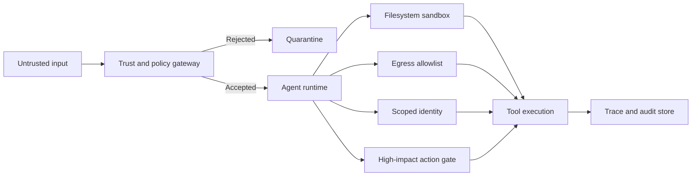

# Agent Capability Containment

## Recommendation

**[Official recommendation + engineering synthesis]**

Protect agentic systems by limiting what the agent can technically access and change. Human approval remains useful for high-impact decisions, but repeated permission prompts must not be the primary security boundary.

Containment should survive:

- a mistaken approval;
- prompt injection;
- malicious repository or document content;
- model misinterpretation;
- tool-selection errors;
- compromised downstream data.

## Threat model

An agent may receive instructions or configuration from untrusted sources while holding access to:

- filesystems;
- shells and subprocesses;
- internal APIs;
- cloud identities;
- source repositories;
- network destinations;
- production or administrative operations.

The core risk is not only the probability of a bad action, but the maximum damage the agent is capable of causing.

## Control hierarchy

### 1. Establish trust before loading local behaviour

Treat repository files, workspace configuration, hooks, plugins, localhost listeners, and generated instructions as untrusted until the user or system has explicitly established trust.

Do not execute project-local hooks or parse behaviour-changing configuration before the trust decision.

### 2. Apply least-privilege identity

- Use workload identity or short-lived credentials where available.
- Separate read, write, approval, and administrative identities.
- Scope credentials to the minimum resources and operations.
- Do not expose broad tokens inside model-visible context.

### 3. Isolate filesystem and process access

- Make the default workspace read-only where practical.
- Permit writes only to explicit directories.
- Run generated code and shell commands in a sandbox or disposable environment.
- Block access to host secrets, credential stores, sockets, and unrelated mounts.
- Treat archive extraction, symlinks, and path traversal as security-sensitive operations.

### 4. Control network egress

- Deny network access by default for tools that do not require it.
- Allowlist destinations, ports, methods, and protocols.
- Route sensitive outbound requests through an auditable proxy or gateway.
- Prevent access to metadata services and internal control planes unless explicitly required.

### 5. Gate irreversible actions separately

Require a distinct policy decision for actions such as:

- sending external communications;
- deploying to production;
- deleting or overwriting durable data;
- modifying permissions;
- approving payments or claims;
- executing administrative changes.

Approval should display the proposed action, target, relevant diff or payload, and expected consequence—not merely a generic tool name.

### 6. Observe allowed and blocked behaviour

Record:

- requested tool and arguments;
- identity and policy decision;
- permitted and blocked resources;
- execution result;
- human override;
- correlation and trace identifiers.

Do not place secrets or unnecessary personal data in logs.

## Reference architecture

## When to use

Apply this pattern whenever an agent can execute code, modify state, use credentials, call external services, or process instructions from sources outside the trusted control plane.

## When this is insufficient

Containment does not replace:

- secure tool implementation;
- input and output validation;
- prompt-injection defences;
- model and workflow evaluation;
- business authorization;
- data governance;
- incident response.

## Common anti-patterns

### Approval prompt as the only defence

Users become habituated to repeated prompts and may approve risky actions without reviewing the details.

### Full host access for convenience

A tool that can read the whole host, reach arbitrary network destinations, and inherit developer credentials creates an unnecessarily large blast radius.

### Trust after execution

Loading hooks, plugins, or project-local configuration before establishing workspace trust invalidates the later approval boundary.

### Broad shared credentials

A single credential that can read and write across development, test, and production makes policy enforcement and audit attribution difficult.

## Validation checklist

- [ ] Untrusted configuration cannot execute before trust is established.
- [ ] The agent has no implicit access to developer or host credentials.
- [ ] Filesystem write paths are explicit and testable.
- [ ] Network egress is denied or allowlisted.
- [ ] High-impact actions have a separate policy gate.
- [ ] Blocked actions are included in telemetry.
- [ ] Adversarial tests attempt path traversal, symlink escape, prompt injection, credential access, and unauthorized egress.
- [ ] The maximum credible blast radius is documented in the threat model.

## Sources

**[Official Anthropic engineering guidance]**

- https://www.anthropic.com/engineering/how-we-contain-claude
- https://www.anthropic.com/engineering/claude-code-sandboxing
- https://www.anthropic.com/engineering/claude-code-auto-mode

## Verification result — 2026-08-24

Anthropic's current containment guidance still supports the core recommendation: enforce hard capability boundaries across the agent environment, model layer, and external content/tool inputs, and do not rely on repeated human approval as the sole defence. The current engineering report continues to cite approximately 93% approval rates and materially reduced permission prompts under sandboxing, reinforcing approval fatigue as a weak primary control.

## Project evidence

None recorded yet. Add project-specific evidence only after sanitisation and validation.
