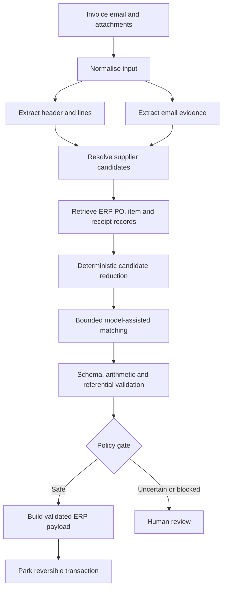
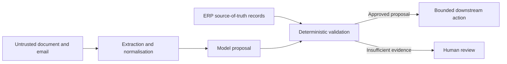

# Case Study: Bounded AI Workflow for Enterprise Accounts Payable Automation

## Executive summary

A completed enterprise project automated part of the accounts-payable invoice workflow by combining document extraction, email context, supplier and purchase-order retrieval, model-assisted line matching, deterministic financial validation, ERP payload construction, and human review.

The system did **not** grant an autonomous agent broad authority over financial processing. The business path was known in advance, so code controlled the workflow while models handled bounded interpretation tasks. Every model output was treated as an untrusted proposal until it passed schema, arithmetic, referential, and policy checks against source-system data.

The downstream action was deliberately reversible: the system prepared and parked a transaction for AP verification rather than automatically completing the final financial posting. On the internal evaluation set, header extraction exceeded 90%, while full line-item automation was materially lower. Purchase-order matching was also the dominant model-cost stage. These results drove a production strategy based on staged metrics, deterministic candidate reduction, explicit block reasons, and selective automation coverage.

Detailed organisation, supplier, dataset, financial-rule, and implementation information remains in a private worklog. Public results are intentionally rounded and should not be treated as a universal benchmark.

## Problem and business context

Invoices arrived through email in many layouts and quality levels. Staff needed to:

- extract document type, dates, currency, totals, purchase-order references, and line items;
- identify the correct supplier and organisational context;
- retrieve valid purchase orders, items, and receipts from an ERP;
- distinguish standard purchasing from service-style purchasing;
- allocate lines without exceeding remaining values or policy limits;
- handle freight and unplanned costs consistently;
- construct a valid downstream payload;
- stop and explain cases that could not be processed safely.

This was not only an OCR problem. The difficult work was reconciling untrusted documents and emails with authoritative ERP data and finance policy.

## Scope and constraints

### In scope

- Email/PDF ingestion
- Header and line extraction
- Supplier resolution
- Purchase-order and receipt retrieval
- Bounded semantic matching
- Structured output and deterministic validation
- Reversible ERP preparation/parking
- Human review and explicit block reasons
- Batch evaluation, checkpointing, tracing, and cost analysis

### Out of scope

- Unrestricted database or ERP access for the model
- Inventing missing suppliers, POs, items, or receipts
- Treating model confidence as financial approval
- Automatically posting every apparently successful case
- Publishing production documents, source code, or organisation-specific policy

### Key constraints

- Financial errors have asymmetric consequences.
- Source-system records must outrank document inference.
- Supplier and document formats have a long tail.
- The system must remain auditable and recoverable.
- Evaluation must separate extraction quality from end-to-end business correctness.
- Human-review capacity is limited, so automation coverage and risk must be balanced.

## Why a workflow instead of an autonomous agent

The overall process had a predictable sequence and hard policy gates. This made a bounded workflow more appropriate than an agent that dynamically chose its own plan.

```text
Known business sequence
+ bounded model tasks
+ authoritative retrieval
+ typed validation
+ human approval
```

Anthropic's official agent guidance distinguishes predefined workflows from agents that dynamically direct their own process and recommends starting with the simplest architecture that meets the need. That principle aligned with the project evidence: modular model-assisted stages were useful, but broad autonomy was not required.

## Architecture



### Trust boundaries



- Documents and emails are untrusted inputs.
- Model outputs are untrusted until validated.
- ERP data is authoritative for suppliers, POs, items, receipts, and financial values.
- The model receives bounded candidates rather than unrestricted system access.
- The automated action is reversible and subject to human verification.

## Business logic

Durable rules were separated from prompt wording.

| Rule | Type | Evidence source | Failure action |
|---|---|---|---|
| Document and credit-note classification | Mixed | Document evidence plus approved mapping | Review unsupported/ambiguous cases |
| Supplier resolution | Hierarchical | Valid PO relationship, trusted email evidence, exact/normalised match, bounded ranking | Unresolved state |
| PO validity | Deterministic | ERP | Block invalid references |
| Item/receipt candidate set | Deterministic retrieval | ERP | Block when required evidence is absent |
| Ambiguous line matching | Probabilistic inside bounded candidates | Document plus ERP candidates | Validate or review |
| Totals and remaining value | Deterministic | Document arithmetic and ERP values | Block on mismatch/exceedance |
| Service and receipt behavior | Deterministic policy | Approved purchasing rules | Block or approved exception path |
| Freight treatment | Contextual rule | Invoice structure and PO policy | Prevent omission/double count |
| Downstream action | Deterministic policy | Risk boundary | Park only; review uncertainty |

### Evidence hierarchy

```text
Authoritative ERP record
> approved deterministic business rule
> exact document/email evidence
> bounded model inference
> unsupported assumption
```

The model could rank or map valid candidates; it could not create source-system facts.

## Implementation process

### Phase 1: broad automation goal

The initial design targeted both header extraction and detailed PO line allocation.

### Phase 2: modular pipeline

The solution separated document extraction, email enrichment, supplier resolution, PO retrieval/matching, validation, and payload construction. Structured intermediate state made stage-level testing possible.

### Phase 3: evidence-driven controls

Historical testing showed a large performance difference between header extraction and full line-item automation. The design added or strengthened:

- deterministic supplier and PO shortcuts;
- hard matches before semantic ranking;
- remaining-value and service-policy checks;
- explicit unsupported and blocked statuses;
- park-first behavior;
- checkpointed batch results;
- per-stage token and failure analysis.

### Phase 4: selective production boundary

The system delivered useful preparation automation without pretending that every invoice was equally automatable. High-confidence cases proceeded to a reversible downstream state; difficult cases retained human ownership.

## Evaluation

### Dataset approach

The internal evaluation set used historical invoice emails and attachments across multiple purchasing and document categories. It included recurring suppliers and long-tail cases. Exact composition is private.

### Stage-level metrics

The evaluation separated:

1. header field extraction;
2. supplier resolution;
3. PO retrieval/validation;
4. line and receipt matching;
5. payload validity;
6. end-to-end business outcome;
7. manual-review, blocked, and unsupported outcomes.

### Rounded results

- Header extraction exceeded 90% on the internal set.
- Full end-to-end automation was materially lower than header-only extraction.
- Purchase-order matching consumed the majority of model context/cost.
- Long-tail suppliers and special purchasing cases caused disproportionate failures.

### Why one accuracy number was insufficient

A correct invoice number and total do not prove that the selected supplier, PO, receipt, line allocation, tax treatment, or downstream payload is correct. Production evaluation therefore needs both stage metrics and consequence-aware business metrics, especially the false-auto-accept rate.

## Security, safety, and governance

- Restrict model access to bounded inputs and candidate records.
- Keep ERP mutation behind application-controlled tools and validation.
- Use least privilege and managed identity where the current platform supports it.
- Store secrets outside prompts, source code, and configuration committed to Git.
- Redact documents, emails, suppliers, and model/tool payloads from logs and traces unless explicitly required and protected.
- Treat document/email content as possible prompt-injection input; do not allow it to redefine system policy or tool permissions.
- Require human approval for consequential or uncertain actions.
- Version prompts, schemas, rules, models, and evaluation datasets.

## Reliability and observability

The project used persistent per-document result records to support:

- checkpoint and resume;
- explicit terminal status;
- stage output inspection;
- token/cost analysis;
- failure-category aggregation;
- comparison across prompt/rule/model versions.

A production implementation should also include correlation IDs, bounded retries, timeout/backoff, idempotent downstream writes, dead-letter/quarantine paths, and redacted end-to-end tracing.

## What worked

- Modular typed stages instead of one opaque prompt
- Retrieval from the source system before reasoning
- Deterministic shortcuts before model matching
- Explicit financial and policy gates
- Reversible downstream action
- Stage-level evaluation and failure taxonomy
- Checkpointed batch processing

## What failed or underperformed

- Large PO candidate contexts increased cost and ambiguity.
- Repeated model calls did not fix missing source-system evidence.
- Header quality could create false confidence about end-to-end readiness.
- A universal prompt did not solve the supplier/document long tail.
- Business rules embedded only in prompts were harder to govern and test.

## Reusable patterns

- [Bounded Document Automation Workflow](../10-patterns/bounded-document-automation-workflow.md)
- [ADR-001: Use a bounded workflow over an autonomous agent](../decisions/ADR-001-use-bounded-workflow-over-autonomous-agent.md)

Additional patterns supported by the case:

- Deterministic-first candidate reduction
- Evidence hierarchy and source-system grounding
- Confidence-and-policy-gated human review
- Draft/park-before-commit
- Stage-level evaluation
- Failure-aware retry

## Best-practice mapping

| Project decision | Evidence label | Current primary source | Alignment or gap |
|---|---|---|---|
| Use fixed orchestration with bounded model stages | Official recommendation + project evidence | Anthropic, *Building effective agents* | Aligns with using workflows for well-defined tasks and adding complexity only when justified |
| Event-driven document extraction, schema mapping, quality checks, and human validation | Reference architecture | Microsoft Azure Architecture Center, *Extract and map information from unstructured content* | Strong conceptual alignment; the historical project used its own implementation stack |
| Use document extraction/OCR as one component of a larger intelligent-document-processing pipeline | Official product guidance | Microsoft Document Intelligence documentation | Aligns; OCR alone did not solve ERP matching and policy |
| Run quality/safety evaluation against datasets and inspect sample-level results | Official recommendation | Microsoft Foundry evaluation guidance | Future implementation should formalise versioned evaluation runs and gates |
| Constrain outputs with schemas and validate before action | Official recommendation | OpenAI structured outputs guidance | Aligns conceptually; deterministic business validation remains required beyond schema compliance |
| Continuously expand evaluation data with discovered edge cases | Official recommendation | OpenAI evaluation best practices and Datasets guidance | Aligns with adding production overrides and long-tail failures to regression suites |
| Evaluate multi-step behavior and intermediate failures | Official recommendation | Anthropic, *Demystifying evals for AI agents* | Aligns with stage-level and failure-category evaluation |

## How to build it today

A new implementation should preserve the pattern but re-evaluate the products and APIs:

1. Use the current generally available Microsoft document-processing service that best matches the document types; verify the current Document Intelligence/Content Understanding boundary and API lifecycle.
2. Use event-driven orchestration with explicit state, idempotency, retry policy, quarantine, and human-review queues.
3. Use structured outputs for model contracts, followed by deterministic domain validation.
4. Retrieve and reduce ERP candidates before semantic matching.
5. Build an evaluation dataset and stage-level graders before broadening automation coverage.
6. Treat current platform evaluation tooling as versioned and changeable. For example, OpenAI's official documentation marks its legacy Evals platform for retirement in 2026 and directs new iterative work toward current dataset/evaluation workflows; do not encode a long-lived playbook around an obsolete product name.
7. Redact sensitive input/output from tracing and logs by default.
8. Expand from park/draft to more autonomous action only after a business-approved risk assessment and strong false-auto-accept evidence.

## Limitations and open questions

- The case does not publish the underlying documents, prompts, source code, or supplier-specific rules.
- Rounded project results cannot be compared directly with other organisations or datasets.
- The internal evaluation should be formalised with immutable dataset manifests and versioned holdouts before making stronger benchmark claims.
- A future implementation should test whether improved deterministic retrieval can reduce the expensive matching stage enough to change the architecture.

## Sources

- Microsoft Azure Architecture Center: https://learn.microsoft.com/en-us/azure/architecture/ai-ml/idea/multi-modal-content-processing
- Microsoft Document Intelligence: https://learn.microsoft.com/en-us/azure/ai-services/document-intelligence/overview?view=doc-intel-4.0.0
- Microsoft Foundry evaluation: https://learn.microsoft.com/en-us/azure/foundry/how-to/evaluate-generative-ai-app
- Anthropic, Building effective agents: https://www.anthropic.com/engineering/building-effective-agents
- Anthropic, Demystifying evals for AI agents: https://www.anthropic.com/engineering/demystifying-evals-for-ai-agents
- OpenAI structured outputs: https://developers.openai.com/api/docs/guides/structured-outputs
- OpenAI evaluation best practices: https://developers.openai.com/api/docs/guides/evaluation-best-practices
- OpenAI Datasets/evaluation getting started: https://developers.openai.com/api/docs/guides/evaluation-getting-started
