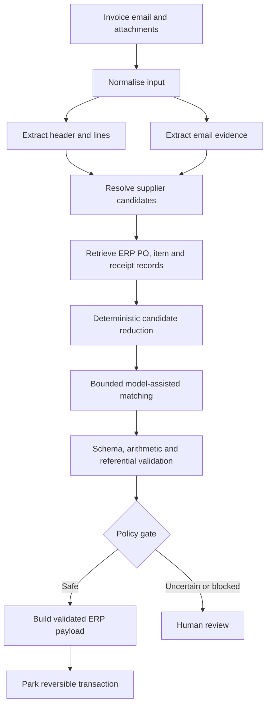

# Case Study: Bounded AI Workflow for Enterprise Accounts Payable Automation

## Executive summary

A completed enterprise project automated part of an accounts-payable invoice workflow by combining document extraction, email context, supplier and purchase-order retrieval, model-assisted line matching, deterministic financial validation, ERP payload construction, and human review.

The system did not grant an autonomous agent broad authority over financial processing. The business path was known in advance, so code controlled the workflow while models handled bounded interpretation tasks. Every model output was treated as an untrusted proposal until it passed schema, arithmetic, referential, and policy checks against source-system data.

The downstream action was deliberately reversible: the system prepared and parked a transaction for AP verification rather than automatically completing the final financial posting. On the internal evaluation set, header extraction exceeded 90%, while full line-item automation was materially lower. Purchase-order matching was also the dominant model-cost stage. These results drove a production strategy based on staged metrics, deterministic candidate reduction, explicit block reasons, and selective automation coverage.

Detailed organisation, supplier, dataset, financial-rule, and implementation information remains in a private worklog. Public results are intentionally rounded and should not be treated as universal benchmarks.

## Problem and constraints

Invoices arrived through email in many layouts and quality levels. Staff needed to extract document fields, identify the correct supplier, retrieve authoritative ERP purchase-order and receipt records, allocate lines without exceeding remaining values or policy limits, construct a valid downstream payload, and explain cases that could not be processed safely.

This was not only an OCR problem. The difficult work was reconciling untrusted documents and emails with authoritative ERP data and finance policy.

Key constraints included:

- financial errors have asymmetric consequences;
- source-system records must outrank document inference;
- supplier and document formats have a long tail;
- the system must remain auditable and recoverable;
- evaluation must separate extraction quality from business correctness;
- human-review capacity is limited.

## Why a bounded workflow

The overall process had a predictable sequence and hard policy gates. This made a bounded workflow more appropriate than an agent that dynamically chose its own plan.

```text
Known business sequence
+ bounded model tasks
+ authoritative retrieval
+ typed validation
+ human approval
```

Anthropic's official guidance distinguishes predefined workflows from agents that dynamically direct their own process and recommends starting with the simplest architecture that meets the need. The project evidence supported that choice: modular model-assisted stages were useful, but broad autonomy was unnecessary.

## Architecture



### Trust boundaries

- Documents and emails are untrusted inputs.
- Model outputs are untrusted until validated.
- ERP data is authoritative for suppliers, purchase orders, items, receipts, and financial values.
- The model receives bounded candidates rather than unrestricted system access.
- The automated action is reversible and subject to human verification.

## Durable business logic

Rules were separated from prompt wording.

| Rule | Type | Evidence source | Failure action |
|---|---|---|---|
| Document classification | Mixed | Document evidence plus approved mapping | Review unsupported or ambiguous cases |
| Supplier resolution | Hierarchical | Valid PO relationship, trusted email evidence, exact or normalised match, bounded ranking | Unresolved state |
| PO validity | Deterministic | ERP | Block invalid references |
| Item and receipt candidates | Deterministic retrieval | ERP | Block when required evidence is absent |
| Ambiguous line matching | Probabilistic inside bounded candidates | Document plus ERP candidates | Validate or review |
| Totals and remaining value | Deterministic | Document arithmetic and ERP values | Block on mismatch or exceedance |
| Service and receipt behaviour | Deterministic policy | Approved purchasing rules | Block or approved exception path |
| Freight treatment | Contextual rule | Invoice structure and PO policy | Prevent omission or double count |
| Downstream action | Deterministic policy | Risk boundary | Park only; review uncertainty |

Evidence priority was:

```text
Authoritative ERP record
> approved deterministic business rule
> exact document or email evidence
> bounded model inference
> unsupported assumption
```

The model could rank or map valid candidates; it could not create source-system facts.

## Implementation evolution

1. The initial design targeted both header extraction and detailed PO line allocation.
2. The solution was decomposed into typed stages for extraction, enrichment, supplier resolution, ERP retrieval, matching, validation, and payload construction.
3. Historical testing showed a large performance gap between header extraction and full line-item automation.
4. Deterministic shortcuts, hard matches, remaining-value checks, explicit blocked states, park-first behaviour, checkpointing, and per-stage cost analysis were strengthened.
5. The production boundary became selective: high-confidence cases proceeded to a reversible state while difficult cases retained human ownership.

## Evaluation

The internal dataset used historical invoice emails and attachments across recurring and long-tail purchasing cases. Exact composition remains private.

Evaluation separated:

1. header extraction;
2. supplier resolution;
3. PO retrieval and validation;
4. line and receipt matching;
5. payload validity;
6. end-to-end business outcome;
7. manual-review, blocked, and unsupported outcomes.

Rounded results:

- header extraction exceeded 90% on the internal set;
- full end-to-end automation was materially lower;
- PO matching consumed the majority of model context and cost;
- long-tail suppliers and special purchasing cases caused disproportionate failures.

A correct invoice number and total do not prove that supplier, PO, receipt, allocation, tax treatment, or payload are correct. Production evaluation therefore needs stage metrics and consequence-aware business metrics, especially false auto-accept rate.

## Security and production controls

- Restrict model access to bounded inputs and candidate records.
- Keep ERP mutation behind application-controlled tools and validation.
- Use least privilege and workload identity where available.
- Store secrets outside prompts, source code, and committed configuration.
- Redact documents, emails, suppliers, and model/tool payloads from logs by default.
- Treat document content as possible prompt-injection input.
- Require human approval for consequential or uncertain actions.
- Version prompts, schemas, rules, models, SDKs, and evaluation datasets.
- Use correlation IDs, bounded retries, idempotent writes, quarantine paths, and redacted tracing.

## What worked

- Modular typed stages instead of one opaque prompt
- Retrieval from the source system before reasoning
- Deterministic shortcuts before model matching
- Explicit financial and policy gates
- Reversible downstream action
- Stage-level evaluation and failure taxonomy
- Checkpointed batch processing

## What underperformed

- Large PO candidate contexts increased cost and ambiguity.
- Repeated model calls did not fix missing source-system evidence.
- Header quality could create false confidence about end-to-end readiness.
- A universal prompt did not solve the supplier and document long tail.
- Business rules embedded only in prompts were difficult to govern and test.

## Reusable guidance

- [Bounded Document Automation Workflow](../10-patterns/bounded-document-automation-workflow.md)
- [ADR-001: Use a bounded workflow over an autonomous agent](../decisions/ADR-001-use-bounded-workflow-over-autonomous-agent.md)

Additional reusable patterns include deterministic-first candidate reduction, source-system grounding, policy-gated human review, draft-before-commit, stage-level evaluation, and failure-aware retry.

## Current best-practice mapping

| Decision | Evidence label | Current source | Alignment |
|---|---|---|---|
| Fixed orchestration with bounded model stages | Official recommendation plus project evidence | Anthropic, *Building effective agents* | Use workflows for well-defined tasks and add autonomy only when justified |
| Event-driven extraction, mapping, quality checks, and human validation | Microsoft reference architecture | Azure Architecture Center multimodal content processing | Strong conceptual alignment |
| Schema-constrained model output followed by deterministic validation | Official recommendation | OpenAI Structured Outputs | Schema compliance does not establish business correctness |
| Dataset-based quality and safety evaluation | Official recommendation | Microsoft Foundry evaluation and OpenAI Evals guidance | Keep versioned datasets, sample-level inspection, and release gates |
| Evaluate multi-step behaviour and intermediate failures | Official recommendation | Anthropic, *Demystifying evals for AI agents* | Aligns with stage-level evaluation |

## How to build it today

1. Re-evaluate the current generally available Microsoft document-processing service for the document types; verify individual service and feature lifecycle before selection.
2. Use event-driven orchestration with explicit state, idempotency, retry, quarantine, and human-review queues.
3. Use structured outputs for model contracts, followed by deterministic domain validation.
4. Retrieve and reduce ERP candidates before semantic matching.
5. Build a versioned evaluation dataset and stage-level graders before increasing automation coverage.
6. Use the current OpenAI Evals API or current dataset/evaluation workflows when OpenAI tooling is selected. As of 2026-08-02, the official API reference still documents `/v1/evals`; no official 2026 retirement notice was found. Do not infer a lifecycle event without an authoritative announcement.
7. Redact sensitive input and output from tracing by default.
8. Expand from park or draft to more autonomous action only after a business-approved risk assessment and strong false-auto-accept evidence.

## Limitations

- The case does not publish documents, prompts, source code, or supplier-specific rules.
- Rounded project results cannot be compared directly with other organisations or datasets.
- The internal evaluation should be formalised with immutable dataset manifests and versioned holdouts before stronger benchmark claims.
- A future implementation should test whether improved deterministic retrieval can reduce the expensive matching stage enough to change the architecture.

## Sources

- Microsoft Azure Architecture Center: https://learn.microsoft.com/en-us/azure/architecture/ai-ml/idea/multi-modal-content-processing
- Microsoft Document Intelligence: https://learn.microsoft.com/en-us/azure/ai-services/document-intelligence/overview
- Microsoft Foundry evaluation: https://learn.microsoft.com/en-us/azure/foundry/how-to/evaluate-generative-ai-app
- Anthropic, Building effective agents: https://www.anthropic.com/engineering/building-effective-agents
- Anthropic, Demystifying evals for AI agents: https://www.anthropic.com/engineering/demystifying-evals-for-ai-agents
- OpenAI Structured Outputs: https://developers.openai.com/api/docs/guides/structured-outputs
- OpenAI Evals API reference: https://platform.openai.com/docs/api-reference/evals
- OpenAI evaluation best practices: https://developers.openai.com/api/docs/guides/evaluation-best-practices
