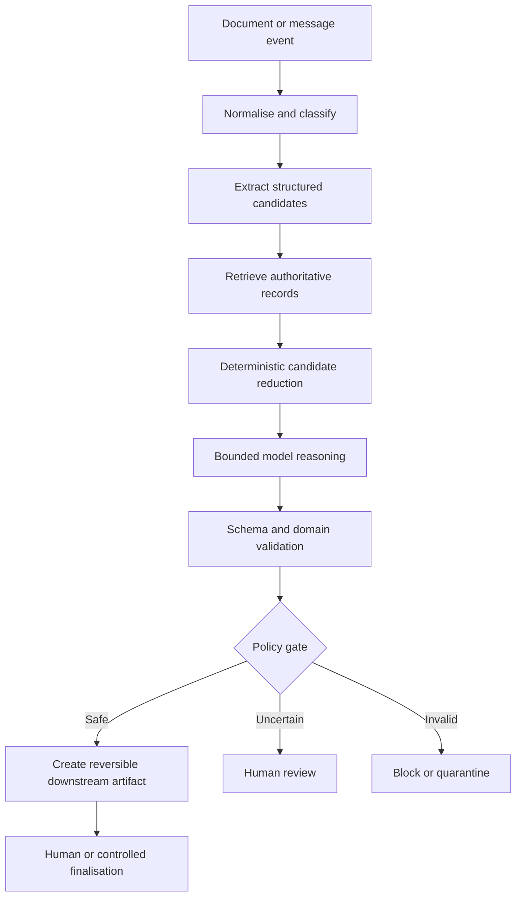

# Pattern: Bounded Document Automation Workflow

## Intent

Automate document-heavy business processes safely by combining deterministic orchestration, authoritative retrieval, bounded model tasks, typed validation, explicit policy gates, reversible actions, and human review.

The pattern is designed for workflows such as invoices, claims, applications, onboarding documents, contracts, and compliance submissions where documents are variable but the business process is known and the consequences of false automation are material.

## Context

Use this pattern when:

- input documents are unstructured or semi-structured;
- multiple evidence sources must be reconciled;
- the source system contains authoritative records;
- some steps benefit from semantic interpretation;
- business rules and approval boundaries are deterministic;
- the system must explain why a case proceeded, stopped, or required review;
- a reversible draft/park/preparation state exists.

## Forces

- **Flexibility versus predictability:** documents vary, but financial or operational policy must remain stable.
- **Automation coverage versus false accepts:** more automatic processing can increase consequential errors.
- **Context size versus matching quality:** sending more candidates can increase both cost and confusion.
- **Model capability versus source-of-truth authority:** plausible inference must not replace missing records.
- **Throughput versus human-review capacity:** uncertainty must be routed selectively.
- **Framework convenience versus transparency:** orchestration should remain inspectable and testable.

## Pattern



### Core responsibilities

1. **Normalisation layer** — parses files/messages, rejects unsupported formats, and records immutable input metadata.
2. **Extraction layer** — converts document content into typed candidate fields without claiming source-system truth.
3. **Retrieval layer** — loads valid records from systems of record.
4. **Candidate-reduction layer** — applies exact IDs, rules, filters, and constraints before semantic reasoning.
5. **Model layer** — resolves bounded ambiguity from a limited candidate set.
6. **Validation layer** — checks schema, arithmetic, references, policy, and permissions.
7. **Decision layer** — determines proceed, review, block, or quarantine.
8. **Action layer** — creates a bounded, ideally reversible artifact.
9. **Operations layer** — persists state, traces, reason codes, metrics, and checkpoints.

## Decision rules

### Use this pattern when

- the overall sequence can be defined in code;
- success and failure can be tested;
- source-system retrieval is available;
- model reasoning is helpful only in specific stages;
- the downstream action can be bounded;
- the organisation can define review ownership.

### Do not use this pattern when

- the task is a simple deterministic transformation that needs no model;
- the task is genuinely open-ended and required steps cannot be predicted;
- no authoritative evidence exists and model inference would become the only truth;
- there is no safe failure or human-review path;
- the action is irreversible and the evaluation evidence is insufficient;
- the organisation cannot legally or operationally process the document with the selected service.

## Implementation guidance

### 1. Inputs and contracts

- Treat documents, email text, metadata, and embedded instructions as untrusted.
- Preserve original and normalised values separately.
- Give each stage a typed input/output contract.
- Include explicit `unsupported`, `uncertain`, `invalid`, and `refused` outcomes.
- Version schemas with prompts, models, rules, and datasets.

### 2. Retrieval and grounding

```text
extract candidate key
-> normalise
-> retrieve source-system records
-> filter by deterministic constraints
-> pass only bounded candidates to the model
```

Do not ask a model to reconstruct records it can retrieve. Log retrieval recall separately from matching accuracy.

### 3. Model role

Appropriate bounded tasks include:

- extracting fields from difficult layouts;
- classifying document type from an approved taxonomy;
- ranking a small set of valid candidate records;
- mapping descriptions to known schema fields;
- producing a structured explanation for review.

Inappropriate roles include:

- inventing missing source-system records;
- redefining business policy from document text;
- selecting its own unrestricted tools;
- approving consequential actions based on self-reported confidence;
- bypassing failed deterministic controls.

### 4. Validation

Use independent layers:

| Layer | Examples |
|---|---|
| Structural | schema, required fields, types, enums |
| Arithmetic | totals, taxes, quantities, signs, allocations |
| Referential | customer/supplier/PO/claim/contract exists |
| Policy | limits, approvals, receipt rules, eligibility |
| Security | caller identity, tool permission, data boundary |
| Operational | idempotency, duplicate detection, state transition |

Schema compliance is necessary but does not prove business correctness.

### 5. State and checkpointing

Use explicit state transitions and persist results after expensive or externally visible stages.

```text
received
-> extracted
-> grounded
-> matched
-> validated
-> ready | review_required | blocked
-> drafted/parked
-> finalised | corrected | failed
```

A checkpoint should contain enough information to resume safely without storing unnecessary sensitive content.

### 6. Human approval

Human review should be triggered by risk and evidence, not only a raw model-confidence score.

Possible gates:

- missing or contradictory authoritative records;
- value above a risk threshold;
- unsupported document/category;
- ambiguous top candidates;
- validation disagreement;
- new supplier/customer/layout;
- model/rule version in canary rollout;
- action that is not reversible.

Capture human corrections as evaluation evidence, with privacy controls.

### 7. Failure handling

Classify before retrying:

| Failure class | Retry? | Response |
|---|---|---|
| Transient network/rate limit | Yes, bounded | backoff and checkpoint |
| Malformed model contract | Limited | repair/retry, then review/block |
| Missing authoritative record | No | block or request data |
| Policy violation | No | block or approved exception workflow |
| Unsupported case | No automatic retry | manual lane and coverage tracking |
| Duplicate/idempotency conflict | No blind retry | inspect existing state |

### 8. Observability

Measure:

- extraction accuracy by field;
- retrieval recall;
- candidate-set size;
- matching accuracy;
- validation failure categories;
- false-auto-accept and false-review rates;
- human correction rate and handling time;
- model calls, tokens, latency, and cost by stage;
- retries and external dependency failures;
- downstream business outcome.

Trace identifiers should link stages without exposing sensitive payloads by default.

### 9. Security

- Use least privilege for every integration.
- Keep model-facing tools read-only unless a write is required and approved.
- Put write actions behind deterministic validation and approval.
- Redact or disable sensitive trace capture.
- Treat retrieved/document content as data, not authority over system instructions.
- Use idempotency and audit records for downstream writes.
- Separate development/test data from production data.

## Consequences

### Benefits

- Predictable and auditable control flow
- Better failure isolation
- Safer use of probabilistic models
- Reusable evaluation boundaries
- Lower blast radius
- Easier staged rollout
- Clearer cost optimisation
- Supports partial automation value

### Costs and risks

- More orchestration and validation code
- Domain rules require ownership and maintenance
- Human-review workflow must be operated
- Candidate retrieval quality becomes a critical dependency
- Partial automation may be less visually impressive than an autonomous demo
- Poorly designed stage contracts can still transfer ambiguity downstream

## Evaluation

Use at least four metric groups:

### Task quality

Field extraction, classification, retrieval recall, matching, and payload correctness.

### Safety/business risk

False-auto-accept rate, value-weighted error, policy violation rate, and irreversible-action errors.

### Operations

Review rate, correction time, throughput, dependency failure, retry, and recovery.

### Efficiency

Latency, model calls, tokens, cost, candidate-set size, and cache/reuse rate.

Averages should be sliced by document category, source, supplier/customer, value band, and new-versus-known cases where legally and operationally appropriate.

## Common failure modes

| Failure | Cause | Detection | Mitigation |
|---|---|---|---|
| Good OCR but wrong transaction | Extraction metric mistaken for end-to-end success | stage/business metric gap | end-to-end and consequence-aware evals |
| Semantic match invents certainty | too many or invalid candidates | source-record and margin checks | deterministic filtering and review |
| Repeated retry returns different guesses | no new evidence | repeated business failure | failure-aware retry policy |
| Model follows instructions inside document | untrusted content treated as control | red-team tests and tool logs | instruction/data separation and bounded tools |
| Duplicate downstream action | retry without idempotency | duplicate key/state conflict | idempotency key and state machine |
| Logs expose sensitive documents | trace captures raw inputs/outputs | privacy review | redaction/minimisation and restricted debugging |
| Long tail destroys average quality | uneven layouts/processes | slice analysis | coverage-based rollout and exception lanes |
| Business rules drift inside prompts | no policy ownership/versioning | inconsistent outputs | code/config rules, tests, and change control |

## Variants

- **Extraction-only assistant:** stop after structured extraction and review.
- **Draft/park workflow:** create a reversible downstream artifact.
- **High-confidence straight-through subset:** automate a narrow, approved segment after strong evaluation.
- **Two-stage matching:** cheap deterministic/lightweight model stage before expensive reasoning.
- **Specialist lane:** route known difficult categories to dedicated rules/models or manual teams.
- **Agentic exception investigator:** use an agent only after the bounded workflow fails, with read-only tools and human-controlled actions.

## Project evidence

- [Enterprise Accounts Payable Automation](../09-case-studies/enterprise-accounts-payable-automation.md)

The project showed that header extraction could exceed 90% while end-to-end line allocation remained materially lower, and that the expensive reasoning stage was purchase-order matching. This supports stage-level evaluation and deterministic candidate reduction but is not a universal benchmark.

## Best-practice mapping

| Guidance | Evidence label | Primary source | Notes |
|---|---|---|---|
| Prefer simple workflows for well-defined tasks | Official recommendation | Anthropic, *Building effective agents* | Use agents only when dynamic planning adds measured value |
| Use event-driven document processing, schema mapping, quality checks, and user validation | Reference architecture | Microsoft Azure Architecture Center, multimodal content processing | Technology choices must be adapted to the workload |
| Use document extraction services for typed document content | Official product guidance | Microsoft Document Intelligence | Extraction is only one stage of business automation |
| Evaluate against datasets with built-in/custom evaluators | Official recommendation | Microsoft Foundry evaluation guidance | Verify current GA/preview status before production use |
| Constrain model output to a schema | Official recommendation | OpenAI structured outputs | Follow with independent domain validation |
| Expand datasets with discovered edge cases | Official recommendation | OpenAI evaluation best practices/Datasets | Keep immutable holdouts as well as a growing regression set |
| Evaluate multi-step trajectories and intermediate outcomes | Official recommendation | Anthropic, *Demystifying evals for AI agents* | Applicable even when the system is a workflow rather than an autonomous agent |

## Revisit conditions

Review this pattern when:

- document-processing services or model contracts materially change;
- a source system exposes safer transactional APIs;
- evaluation shows a dynamic agent outperforms fixed orchestration on a genuinely open-ended stage;
- the business approves more autonomous action;
- platform tracing or evaluation products are deprecated or replaced;
- regulation or data policy changes the permissible processing boundary.

## Sources

- https://learn.microsoft.com/en-us/azure/architecture/ai-ml/idea/multi-modal-content-processing
- https://learn.microsoft.com/en-us/azure/ai-services/document-intelligence/overview?view=doc-intel-4.0.0
- https://learn.microsoft.com/en-us/azure/foundry/how-to/evaluate-generative-ai-app
- https://www.anthropic.com/engineering/building-effective-agents
- https://www.anthropic.com/engineering/demystifying-evals-for-ai-agents
- https://developers.openai.com/api/docs/guides/structured-outputs
- https://developers.openai.com/api/docs/guides/evaluation-best-practices
- https://developers.openai.com/api/docs/guides/evaluation-getting-started
