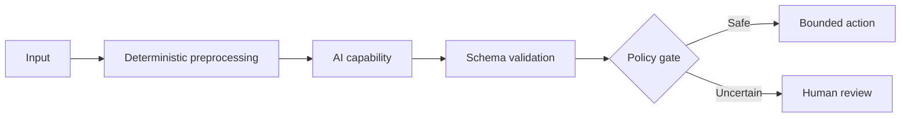

# Case Study: <Title>

## 1. Executive summary

Summarise the business problem, production boundary, architecture, measurable outcome, and most reusable lesson.

## 2. Problem and business context

Describe the workflow before the change, the users, the operational pain, and why the problem mattered.

## 3. Scope and constraints

### In scope

- 

### Out of scope

- 

### Constraints

- Data sensitivity
- Integration and legacy systems
- Accuracy and error consequences
- Human-review capacity
- Latency and cost
- Audit and compliance

## 4. Why AI was or was not needed

Explain which parts were deterministic, which required retrieval, and which benefited from model reasoning. State whether the solution is a workflow, an agent, or a hybrid.

## 5. Architecture

Explain component boundaries, source-of-truth data, state, checkpoints, permissions, human approval, and failure handling.

## 6. Business logic

Document the durable rules separately from prompts.

| Rule | Deterministic/probabilistic | Evidence source | Failure action |
|---|---|---|---|
| | | | |

## 7. Implementation process

Describe the main versions, experiments, failures, and evidence-driven changes. Do not present only the final architecture.

## 8. Evaluation

### Dataset

Describe coverage and limitations without exposing private data.

### Metrics

Report stage-level and business metrics. Include false-auto-accept risk, human-review impact, cost, and latency when available.

### Results

Clearly label rounded project evidence and avoid presenting it as a universal benchmark.

## 9. Security, safety, and governance

- Least privilege and bounded tools
- Secret management
- Data minimisation and redaction
- Prompt-injection boundaries
- Human approval
- Audit and retention
- Change and model-version control

## 10. Reliability and observability

- Correlation and traces
- Validation errors
- Retry and timeout
- Idempotency
- Checkpoint/resume
- Cost and token metrics
- Business outcome monitoring

## 11. What worked

- 

## 12. What failed or underperformed

- 

## 13. Reusable patterns

Link extracted patterns and ADRs.

## 14. Best-practice mapping

| Decision | Evidence label | Primary source | Alignment or gap |
|---|---|---|---|
| | Official requirement / Official recommendation / Reference architecture / Project evidence / Engineering inference | | |

## 15. How to build it today

Separate historical project implementation from current recommendations. Recheck service names, API lifecycle, model capabilities, and preview/GA status.

## 16. Limitations and open questions

- 

## 17. Sources

Use current primary sources first. Community material may explain but must not be the only evidence for a durable recommendation.
