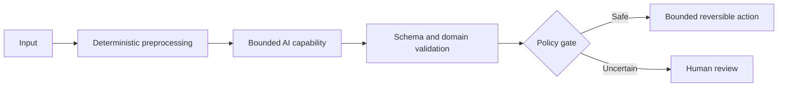

# Case Study: Title

## 1. Executive summary

Summarise the business problem, production boundary, architecture, measurable outcome, and most reusable lesson.

State explicitly that the results are project-specific and must not be treated as a universal benchmark.

## 2. Problem and business context

Describe the workflow before the change, users, operational pain, failure consequences, and why the problem mattered.

## 3. Scope and constraints

### In scope

- 

### Out of scope

- 

### Constraints

- Data sensitivity and publication boundary
- Integration and legacy systems
- Accuracy and asymmetric error consequences
- Human-review capacity
- Latency and cost
- Audit, compliance, and retention

## 4. Why AI was or was not needed

Explain which parts were deterministic, which required retrieval, and which benefited from model reasoning. State whether the solution was a workflow, agent, or hybrid.

## 5. Architecture

Explain component boundaries, systems of record, state, checkpoints, permissions, human approval, and failure handling.

## 6. Business logic

Document durable rules separately from prompts.

| Rule | Deterministic/probabilistic | Evidence source | Failure action |
|---|---|---|---|
| | | | |

## 7. Implementation history

Describe major versions, experiments, failures, and evidence-driven changes. Do not present only the final architecture.

## 8. Evaluation

### Dataset

Describe coverage, slices, holdouts, and limitations without exposing private data.

### Metrics

Report stage-level and business metrics. Include false-auto-accept risk, human-review impact, cost, latency, and operational recovery where available.

### Results

Clearly label rounded project evidence and explain why it cannot be generalised without a comparable dataset.

## 9. Security, safety, and governance

- Least privilege and bounded tools
- Secret management
- Data minimisation and redaction
- Prompt-injection boundaries
- Human approval
- Audit and retention
- Change and model-version control
- Maximum credible blast radius

## 10. Reliability and observability

- Correlation IDs and traces
- Validation errors and reason codes
- Retry classification and timeout
- Idempotency and duplicate control
- Checkpoint and resume
- Cost and token metrics
- Business outcome monitoring

## 11. What worked

- 

## 12. What failed or underperformed

- 

## 13. Reusable knowledge

Link extracted patterns, ADRs, anti-patterns, and canonical guides. The case study should remain supporting evidence rather than the primary recommendation.

## 14. Best-practice mapping

| Decision | Evidence label | Source ID | Alignment or gap |
|---|---|---|---|
| | | | |

## 15. How to build it today

Separate historical project implementation from current recommendations. Recheck service names, API lifecycle, model capabilities, preview/GA status, security features, and supported SDKs.

## 16. Publication and sanitisation record

- Organisation and customer identifiers removed:
- Internal endpoints and account identifiers removed:
- Raw documents and messages removed:
- Confidential thresholds generalised:
- Metrics rounded where appropriate:
- Publication reviewer:

## 17. Limitations and open questions

- 

## 18. Sources

| ID | Source | Evidence | Supports | Checked on | Lifecycle/version |
|---|---|---|---|---|---|
| SRC-001 | Current primary source | official | Specific decision | YYYY-MM-DD | |
