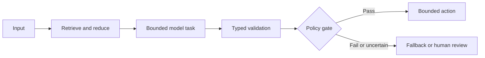

# Pattern: <Pattern Name>

## Intent

What recurring problem does this pattern solve?

## Context

When does the problem appear? Include business risk, data characteristics, integration constraints, and operating conditions.

## Forces

- Accuracy versus automation coverage
- Latency versus reasoning depth
- Cost versus context size
- Flexibility versus predictability
- Autonomy versus control
- Reuse versus domain specificity

## Pattern

Describe the responsibilities and boundaries of each component.

## Decision rules

Use this pattern when:

- 

Do not use this pattern when:

- 

## Implementation guidance

### Inputs and contracts

### Retrieval and grounding

### Model role

### Validation

### State and checkpointing

### Human approval

### Failure handling

### Observability

### Security

## Consequences

### Benefits

- 

### Costs and risks

- 

## Evaluation

Define task-level, stage-level, business, safety, latency, and cost metrics.

## Common failure modes

| Failure | Cause | Detection | Mitigation |
|---|---|---|---|
| | | | |

## Variants

- 

## Project evidence

Link sanitised case studies and clearly separate project results from official recommendations.

## Best-practice mapping

| Guidance | Evidence label | Primary source | Notes |
|---|---|---|---|
| | | | |

## Revisit conditions

List technology, policy, model, or business changes that could supersede the pattern.
