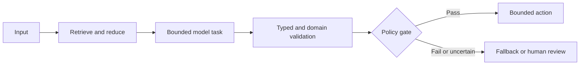

# Pattern: Pattern Name

## Intent

What recurring problem does this pattern solve?

## Context

When does the problem appear? Include business risk, data characteristics, integration constraints, operating conditions, and systems of record.

## Forces

- Accuracy versus automation coverage
- Latency versus reasoning depth
- Cost versus context size
- Flexibility versus predictability
- Autonomy versus control
- Reuse versus domain specificity
- Convenience versus blast radius

## Pattern

Describe responsibilities, trust boundaries, state, source-of-truth data, and stopping conditions.

## Decision rules

Use this pattern when:

- 

Do not use this pattern when:

- 

## Implementation guidance

### Inputs and contracts

### Retrieval and grounding

### Model role

### Validation

### State and checkpointing

### Human approval

### Failure handling

### Observability and provenance

### Security and permissions

### Cost and performance

## Consequences

### Benefits

- 

### Costs and risks

- 

## Evaluation

Define task-level, stage-level, business, safety, latency, cost, and operational metrics. State dataset limitations and regression thresholds.

## Common failure modes

| Failure | Cause | Detection | Mitigation |
|---|---|---|---|
| | | | |

## Variants

- 

## Project evidence

Link sanitised case studies and clearly separate project results from official recommendations. Do not expose private worklog details.

## Best-practice mapping

| Guidance | Evidence label | Source ID | Notes |
|---|---|---|---|
| | | | |

## Related decisions

Link ADRs that explain why this pattern was selected or rejected in a specific context.

## Revisit conditions

List technology, policy, model, security, cost, or business changes that could supersede the pattern.

## Sources

| ID | Source | Evidence | Supports | Checked on | Lifecycle/version |
|---|---|---|---|---|---|
| SRC-001 | Current primary source | official | Specific guidance | YYYY-MM-DD | |
