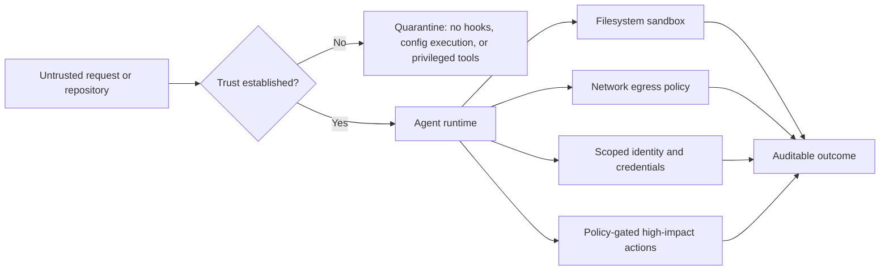

# AI Engineering Weekly Digest — 2026-07-30

## Executive summary

This cycle found three changes worth recording:

1. Microsoft released meaningful July updates for **Agentic Retrieval in Foundry Local**, but the product remains **Preview**. It is relevant for edge, disconnected, and air-gapped RAG rather than a default cloud architecture.
2. Anthropic published a strong production-security lesson: reduce agent blast radius through enforceable capability boundaries, not repeated approval prompts alone.
3. The OpenAI Agents SDK is still evolving rapidly under `0.Y.Z`; recent releases changed defaults and runtime behaviour. Production systems should pin versions, configure models explicitly, and regression-test SDK upgrades.

No change was found to the AI-103 skills outline: the current guide still lists skills measured as of 16 April 2026.

## Findings

### 1. Microsoft Foundry Local Agentic Retrieval 0.9.5

**Classification:** added  
**Evidence:** official release notes  
**Lifecycle:** Preview  
**Production impact:** targeted; not a general replacement for managed Azure AI Search or cloud-hosted RAG

Microsoft's July 2026 update adds horizontally scaled document parsing, automatic ingestion retries, multi-source knowledge bases, multistep conversational evaluation, improved disconnected deployment, security hardening, and a recommended 32K model context window.

Use this only when the workload genuinely requires local, edge, disconnected, or air-gapped operation. Preview status, infrastructure requirements, supported ingress constraints, and known issues should be recorded in an ADR before adoption.

Sources:

- https://learn.microsoft.com/en-us/azure/azure-arc/agents-tools-foundry-local/whats-new
- https://learn.microsoft.com/en-us/azure/azure-arc/edge-rag/release-notes

### 2. Agent security should constrain capability, not rely on approval fatigue

**Classification:** added  
**Evidence:** official Anthropic engineering report  
**Lifecycle:** durable engineering guidance  
**Production impact:** high for coding agents and any agent with filesystem, network, shell, or administrative access

Anthropic reports that repeated permission prompts are a weak primary control because users approve most prompts and attention declines over time. The more durable approach is to cap blast radius through filesystem isolation, network egress controls, sandboxing, scoped credentials, and explicit trust establishment before loading project-local configuration.

The most reusable lesson is that repository contents, local configuration, hooks, and localhost listeners should be treated as untrusted input until the trust boundary has been established.

Durable guidance added in `07-security/agent-capability-containment.md`.

Sources:

- https://www.anthropic.com/engineering/how-we-contain-claude
- https://www.anthropic.com/engineering/claude-code-sandboxing
- https://www.anthropic.com/engineering/claude-code-auto-mode

### 3. OpenAI Agents SDK requires explicit dependency and default control

**Classification:** changed  
**Evidence:** official SDK changelog  
**Lifecycle:** current; rapidly evolving pre-1.0 SDK  
**Production impact:** high for applications that inherit SDK defaults

The SDK documents that minor `0.Y` versions can contain breaking public-interface changes. Recent releases also changed default models, refusal handling, MCP failure behaviour, handoff history, synchronous tool execution, and supported Python/OpenAI package versions.

Do not allow production behaviour to change because a dependency resolver selected a newer minor version. Pin the SDK, configure the model and reasoning settings explicitly, run behavioural regression suites, and review migration notes before upgrading.

Durable guidance added in `08-production/sdk-version-and-default-control.md`.

Source:

- https://openai.github.io/openai-agents-python/release/

### 4. AI-103 study guide remains unchanged

**Classification:** no-action  
**Evidence:** official Microsoft study guide  
**Last stated skills date:** 2026-04-16

The current weighting remains:

- Plan and manage an Azure AI solution: 25–30%
- Implement generative AI and agentic solutions: 30–35%
- Computer vision: 10–15%
- Text analysis: 10–15%
- Information extraction: 10–15%

Source:

- https://learn.microsoft.com/en-us/credentials/certifications/resources/study-guides/ai-103

## Engineering Pattern of the Week

### Capability containment before behavioural supervision

Use human approval for genuinely consequential decisions, but do not make approval prompts the only control. Define what the agent is technically capable of doing even after a mistaken approval, compromised prompt, or model failure.

Recommended control order:

1. Establish trust before parsing or executing local configuration.
2. Minimise identity scope and credential lifetime.
3. Restrict filesystem write paths and process execution.
4. Restrict network destinations and protocols.
5. Make irreversible or high-impact actions separately policy-gated.
6. Log attempted and blocked actions as well as successful actions.

## Code Picks

### 1. `openai/openai-agents-python`

Repository: https://github.com/openai/openai-agents-python

Reading order:

1. `docs/release.md` or the rendered release documentation — understand compatibility guarantees first.
2. `src/agents/run.py` — inspect the run loop, turn limits, and lifecycle.
3. `src/agents/tool.py` — study function-tool contracts and failure handling.
4. `src/agents/mcp/` — examine MCP session and server abstractions.
5. `tests/` for refusals, handoffs, sessions, and tool execution — use tests as behavioural documentation.

### 2. `anthropics/claude-agent-sdk-python`

Repository: https://github.com/anthropics/claude-agent-sdk-python

Reading order:

1. `README.md` and examples — map supported runtime patterns.
2. SDK client and query entry points — understand session lifecycle.
3. Tool and hook abstractions — identify capability boundaries.
4. Permission or configuration handling — compare supervision with containment.
5. Tests — inspect expected failure and cancellation behaviour.

### 3. `MicrosoftLearning/mslearn-ai-agents`

Repository: https://github.com/MicrosoftLearning/mslearn-ai-agents

Reading order:

1. Repository lab map — align exercises to AI-103 objectives.
2. Foundry project and authentication setup labs.
3. Tool integration and knowledge grounding labs.
4. Evaluation and monitoring labs.
5. Deployment and security exercises; convert each lab into a production checklist rather than copying demo settings.

### 4. `modelcontextprotocol/python-sdk`

Repository: https://github.com/modelcontextprotocol/python-sdk

Reading order:

1. Protocol concepts and transport documentation.
2. Server examples and tool/resource definitions.
3. Authentication and transport layers.
4. Session lifecycle and error handling.
5. Tests for malformed requests, cancellation, and capability negotiation.

## Repository actions

- Added durable guidance for agent capability containment.
- Added durable guidance for SDK version and default control.
- Updated the changelog.
- No deprecation entry added: the Microsoft feature is Preview, not deprecated, and the SDK changes are migration concerns rather than product retirement notices.
